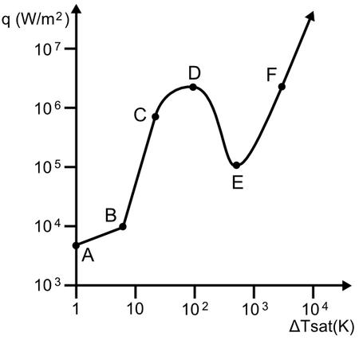
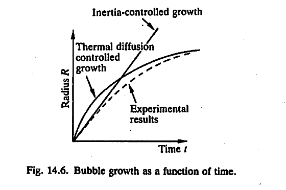

> pool boiling page 
[toc]
### 1. types of boiling 

* nucleate boiling —— vapour bubbles are formed (ususally at a solid surface)
* convective boiling ——  where the heat is conducted through a thin film of liquid 
* film boiling —— the heat surface is blanketed by a film of vapour 

well, the pool boiling 

* q ---- heat flux in the pool boiling 
* $\Delta T$ ---- ($T_{wall} - T_{liquid}$) the wall temperature minus the liquid saturation temperature 

|process|||
|---|---|---|
|A - B|natural convection|single-phase|
|B - D|nucleate boiling|two-phase||
|D - E|transition of boiling||
|E - F|film boiling|

* B --- the onset of nucleate boiling
* D --- the burnout point (the Critical heat flux)
* E --- the minimum film boiling point 

> point D show the CHF (critical heat flux) , that means the end of nucleate boiling peroid 

### 2. visualization of events along the boiling curve 

1. the nucleate boiling (BC)
    1. the isolated bubble region (the bubbles behave independently)
    2. the slugs and columns region(bubbles start to merge and to depart from the heated surface )
2. the film boiling (FDE)
where the heated surface is covered with a layer of vapour 
> the vapour surface is unstable and bubbles are released from it into the liquid 
3. the transition boiling (FC)  ---- complex region 
> where parts of the surface are in film boiling regime and parts in the nucleate boiling regime of the slugs and columns types 

### 3. bubble growth in nucleate boiling 
the bubbles growth is controlled by two factors 
1. *the inertia of the liquid*
2. *thermal diffusion through a boundary layer around bubble* 

### 4. bubble nucleation

> the process of bubble formation is known as nucleation.
(a). are formed at a surface on the glass container;
(b). rise in a chain of bubbles origination from the same spot on the surface ;
(c). often originate from the same spot if the glass is emptied and refilled 