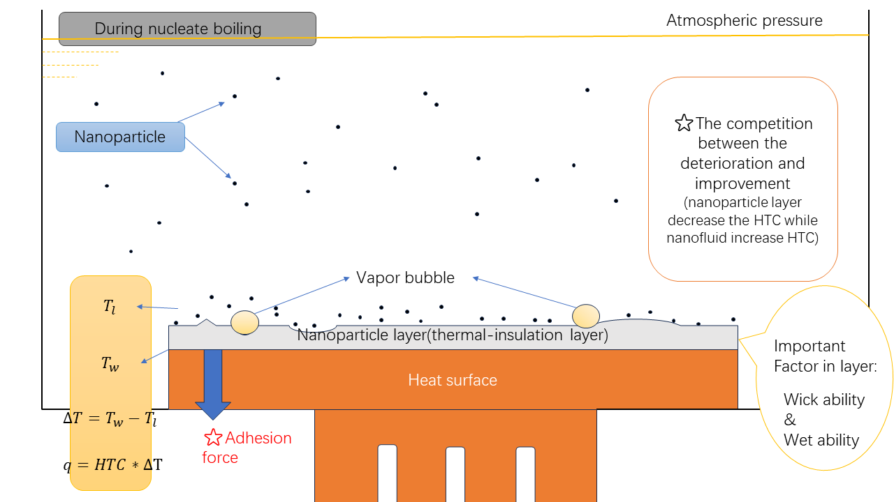

[toc]

## progress 
### summarize the problems 
#### 1 thesis (Ren Ning)
> title: EXPERIMENTS FOR THE MECHANISMS DETERMINING CHF AND HTC VALUES IN NANOFLUID POOL BOILING 

 

### 2. thesis(Yosuke Watanabe)
> title: Nanoparticle layer detachment and its influence on the heat transfer characteristics in saturated pool boiling of nanofluids

